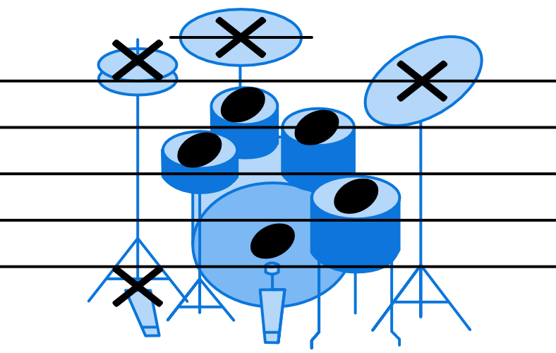
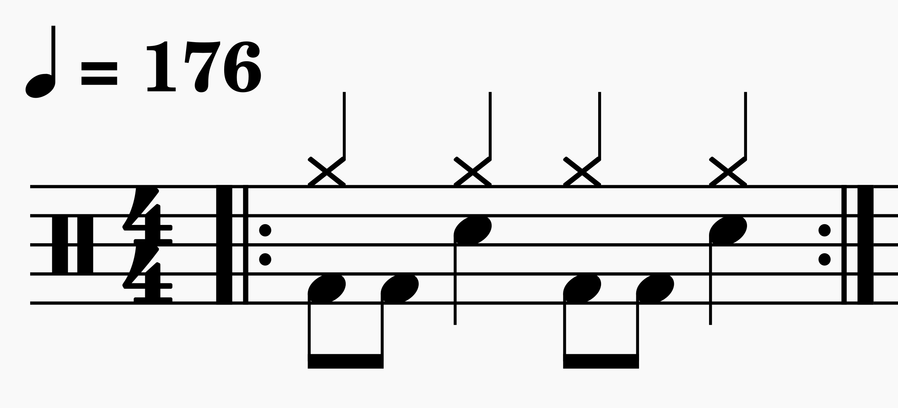
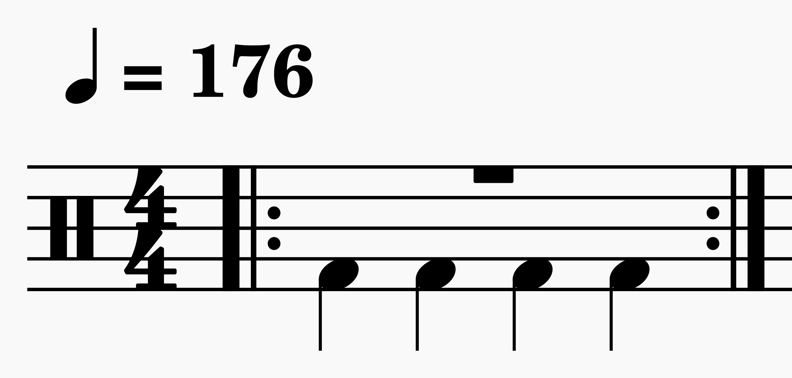
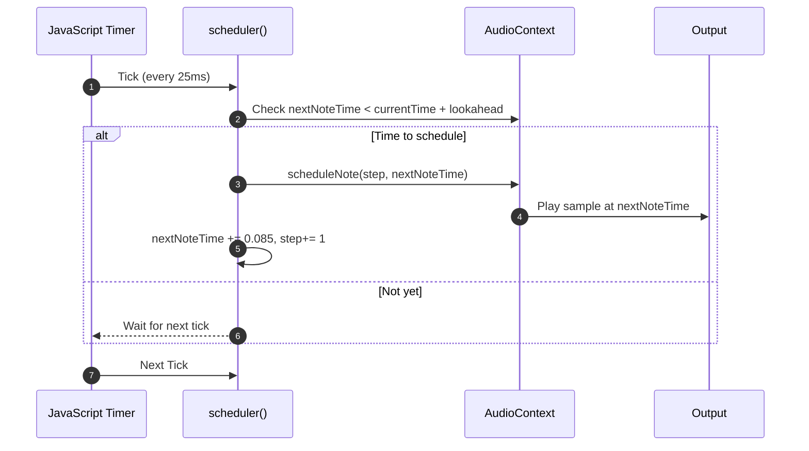

# Javascript fait du bruit (mais en rythme)

## Tremplin de Snowcamp 2026 : UX & Frontend

**Baptiste Lyet**

---

# Plan

- Présentation de DrumBeatRepo
- Définitions
- Construction d'une boîte à rythme
  - **naïve**
  - **synchronisée**


---

# Présentation de DrumBeatRepo

  https://www.drumbeatrepo.com

---

# Définitions
Musique et rythme

### Qu'est ce que la musique ?

<v-click>

- **rythme**
- hauteur
- nuances
- timbre

</v-click>


<!--
Définitions de wikipedia
https://fr.wikipedia.org/wiki/Rythme_(musique)
https://fr.wikipedia.org/wiki/Musique
-->
---

# Définitions
Musique et rythme

### Qu'est ce que le rythme ?

<v-click>

<div class="flex flex-col items-center">
  <div class="flex justify-center gap-12">
    
    
  </div>
  <p class="mt-4 text-gray-500 text-sm">Comment lire une partition de batterie</p>
</div>

</v-click>

---

# Définitions
Séquenceurs et boite à rythme

### Roland 808


<!--
Machine ou logiciel qui génère des boucles de batterie/percussions répétitives et utilise en interne un **séquenceur**

- Musique assistée par ordinateur
- Jeux vidéos

- En musique comme en **frontend**, tout dépend de la **synchronisation**
- Les UIs modernes réagissent en temps réel : **animations**, **streams**, **events**
- Avec **RxJS** ou la **programmation réactive**, on orchestre les événements  
  👉 comme une **partition musicale** : chaque action doit tomber juste.
-->
---

# Construction d'une boite à rythme
Problématique

### Schéma rythmique
```json
"charleston"   : [" ", " ", " ", " ", " ", " ", " ", " ", " ", " ", " ", " ", " ", " ", " ", " "],
"caisseClaire" : [" ", " ", " ", " ", " ", " ", " ", " ", " ", " ", " ", " ", " ", " ", " ", " "],
"grosseCaisse" : ["X", " ", " ", " ", "X", " ", " ", " ", "X", " ", " ", " ", "X", " ", " ", " "]
```



---

# Construction d'une boite à rythme
Problématique

### Vitesse de lecture
- 85 ms pour passer d'une case à l'autre avec un tempo de 176
- https://toolstud.io/music/bpm.php?bpm=176&bpm_unit=4%2F4&base=16


---

# Construction d'une boite à rythme - naïve
_
## SetTimeout()
- déclenche une fonction après un certain temps

```typescript  {monaco-run} {autorun:false}
function scheduler(){
    console.log("Case suivante");
}

console.log("Début");
setTimeout(scheduler, 85);
console.log("Fin");
```

<!--
permet de déclencher une fonction après un certain temps
-->
---

# Construction d'une boite à rythme - naïve
_
## SetTimeout() récursif
- déclenche une fonction à interval de temps régulier

```typescript  {monaco-run} {autorun:false}
function scheduler(){
    console.log("Case suivante");
    setTimeout(scheduler, 85);
}

scheduler()
```
<!--
J'ai fouillé dans la documentation JS et j'ai vu qu'il y a une fonction pour déclencher un évènement après un temps précis
SetInterval()

Ensuite j'ai vu des débats et beaucoup d'utilisation de SetTimeout() en récursif

De toute façon le récursif ça ne me fait pas peur je fonce
-->

---

# Construction d'une boite à rythme - naïve

```ts {monaco-run} {autorun:false}
const pattern = ["X"," "," "," ","X"," "," "," ","X"," "," "," ","X"," "," "," "];
const audio = new Audio('https://soundcamp.org/sounds/381/kick/B/acoustic-kick-drum-one-shot-b-key-201-ywK.wav');

let step = 0;

function scheduler(): void {
    if (pattern[step] === "X") {
        audio.currentTime = 0;
        audio.play();
        console.log(step);
    }

    step = (step + 1) // % pattern.length;
    setTimeout(scheduler, 85); //85 ms
}

scheduler();
```

---

# Construction d'une boite à rythme - naïve

<div class="w-full max-w-3xl mx-auto">
  <SlidevVideo controls class="w-full rounded-xl">
    <source src="/videos/lag.mov" type="video/mp4" />
  </SlidevVideo>
</div>

---

# Construction d'une boite à rythme - naïve



```mermaid
gantt
    dateFormat  HH:mm:ss
    axisFormat  %S.%L s

    section .
    1 : vert, v1, 00:00:00, 0.000s
    . :active, des1, after v1, 0.085s
    2 : vert, v2, after des1, 0.000s
    . :des2, after des1, 0.085s
    3 : vert, v3, after des2, 0.000s
    . :des3, after des2, 0.085s
    4 : vert, v4, after des3, 0.000s

    section .
    . :active, des4, 00:00:00, 0.085s
    . :crit, des5, after des4, 0.105s
    . :des6, after des5, 0.085s
```

## Inconvénients
- Précision à la milliseconde
- Interférences avec thread JavaScript principal
- Dérive d’horloge

---

<!--
Ne pas confondre avec un jitter ou avec une latence

Dérive d’horloge → décalage progressif dans le temps (long terme).
Jitter → fluctuations aléatoires d’un tick à l’autre (court terme).
-->

# Construction d'une boite à rythme - synchronisée

💡 Au lieu de déclencher les sons au dernier moment, on planifie les événements à l’avance.


## Synchronisation JS & WebAudioAPI

```ts {monaco-run} {autorun:false}
var context = new AudioContext();
console.log(context.currentTime);

setTimeout(() => console.log(context.currentTime), 500);

```

---

# Construction d'une boite à rythme - synchronisée


---

# Construction d'une boite à rythme - synchronisée


---

# Construction d'une boite à rythme - synchronisée

<div style="max-height: 400px; overflow:auto;">

```ts {monaco-run} {autorun:false}
const pattern = ["X"," "," "," ","X"," "," "," ","X"," "," "," ","X"," "," "," "];
const lookahead = 0.100; // 100ms

const audioContext = new (window.AudioContext || (window as any).webkitAudioContext)();
let kickBuffer: AudioBuffer, nextNoteTime = audioContext.currentTime, step = 0;

fetch("https://soundcamp.org/sounds/381/kick/B/acoustic-kick-drum-one-shot-b-key-201-ywK.wav")
    .then(res => res.arrayBuffer())
    .then(data => audioContext.decodeAudioData(data))
    .then(buffer => { kickBuffer = buffer; });

function scheduler(): void {
    while (nextNoteTime < audioContext.currentTime + lookahead) {
        scheduleNote(step, nextNoteTime);
        setNextNote();
    }
    setTimeout(scheduler, 25); // 25ms
}

function scheduleNote(step: number, time: number): void {
  if (pattern[step] === "X" && kickBuffer) {
    const source = audioContext.createBufferSource();
    source.buffer = kickBuffer;
    source.connect(audioContext.destination);
    source.start(time);
  }
}

function setNextNote(): void {
  nextNoteTime += 0.085; //85 ms
  step = (step + 1) % pattern.length;
}

scheduler();
```

</div>

---

# Construction d'une boite à rythme - synchronisée

<div class="w-full max-w-3xl mx-auto">
  <SlidevVideo controls class="w-full rounded-xl">
    <source src="/videos/good.mov" type="video/mp4" />
  </SlidevVideo>
</div>

---

# Conclusion
_

### Notions
- minuteur / timer
- horloges / clock

<v-click>

### Solution
- synchronisation d'horloge JavaScript avec horloge tierce (WebAudioAPI)

</v-click>

<v-click>

### Aller plus loin
- UI - **requestAnimationFrame()**
- Changement de tempo et **TimeStretch**

</v-click>

---

# Merci !

--> **Baptiste Lyet** - Développeur .NET/Angular @Sogilis

</> DrumBeatRepo : https://www.github.com/babali42/drumbeatrepo


<style>
html {
  font-size: 17px; /* 16 → 17px = 1.10× scale environ*/
}
</style>