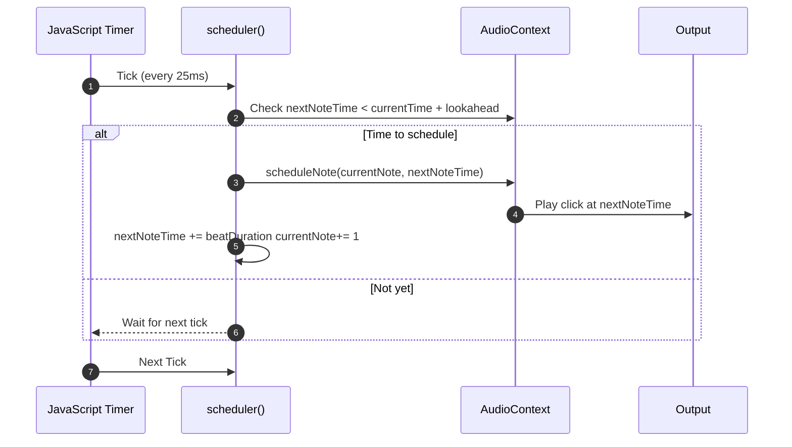

# Javascript fait du bruit (mais en rythme)

## Tremplin de Snowcamp 2026 : UX & Frontend

**Baptiste Lyet**

---

# Plan

- Présentation de DrumBeatRepo
- Définitions
- Construction d'une boîte à rythme
  - **naïve**
  - **synchronisée**


---

# Définitions
Musique et rythme

### Qu'est ce que la musique ?

Combiner sons et silences au cours du temps.


<v-click>

- **rythme**
- hauteur
- nuances
- timbre

</v-click>


<!--
Définitions de wikipedia
https://fr.wikipedia.org/wiki/Rythme_(musique)
https://fr.wikipedia.org/wiki/Musique
-->
---

# Définitions
Musique et rythme

### Qu'est ce que le rythme ?

Le rythme en musique est l'organisation dans le temps des événements musicaux.

<div class="flex flex-col items-center">
  <div class="flex justify-center gap-12">
    
    
  </div>
  <p class="mt-4 text-gray-500 text-sm">Comment lire une partition de batterie</p>
</div>

---

# Définitions
Séquenceurs et boite à rythme

### Roland 808


<!--
Machine ou logiciel qui génère des boucles de batterie/percussions répétitives et utilise en interne un **séquenceur**

- Musique assistée par ordinateur
- Jeux vidéos

- En musique comme en **frontend**, tout dépend de la **synchronisation**
- Les UIs modernes réagissent en temps réel : **animations**, **streams**, **events**
- Avec **RxJS** ou la **programmation réactive**, on orchestre les événements  
  👉 comme une **partition musicale** : chaque action doit tomber juste.
-->
---

# Construction d'une boite à rythme
Problématique

### Schéma rythmique
```json
"hihat" : [" ", " ", " ", " ", " ", " ", " ", " ", " ", " ", " ", " ", " ", " ", " ", " "],
"snare" : [" ", " ", " ", " ", " ", " ", " ", " ", " ", " ", " ", " ", " ", " ", " ", " "],
"kick"  : ["X", " ", " ", " ", "X", " ", " ", " ", "X", " ", " ", " ", "X", " ", " ", " "]
```

### Vitesse de lecture
- 85 ms pour passer d'une case à l'autre avec un tempo de 176
- https://toolstud.io/music/bpm.php?bpm=176&bpm_unit=4%2F4&base=16

---

# Construction d'une boite à rythme
Version naïve : minuteur JS

## SetTimeout()
- déclenche une fonction après un certain temps

```typescript  {monaco-run} {autorun:false}
function loop(){
    console.log("Case suivante");
}

console.log("Début");
setTimeout(loop, 85);
console.log("Fin");
```

<!--
permet de déclencher une fonction après un certain temps
-->
---

# Construction d'une boite à rythme
Version naïve : minuteur JS

## SetTimeout() récursif
- déclenche une fonction à interval de temps régulier

```typescript  {monaco-run} {autorun:false}
function loop(){
    console.log("Case suivante");
    setTimeout(loop, 85);
}

loop()
```
<!--
J'ai fouillé dans la documentation JS et j'ai vu qu'il y a une fonction pour déclencher un évènement après un temps précis
SetInterval()

Ensuite j'ai vu des débats et beaucoup d'utilisation de SetTimeout() en récursif

De toute façon le récursif ça ne me fait pas peur je fonce
-->

---

# Construction d'une boite à rythme
Version naïve : minuteur JS

```ts {monaco-run} {autorun:false}
const pattern = ["X"," "," "," ","X"," "," "," ","X"," "," "," ","X"," "," "," "];
const audio = new Audio('https://codeskulptor-demos.commondatastorage.googleapis.com/GalaxyInvaders/explosion%2001.wav');

const stepTime = 85; let step = 0;

function loop(): void {
    if (pattern[step] === "X") {
        audio.currentTime = 0;
        audio.play();
        console.log(step);
    }

    step = (step + 1) // % pattern.length;
    setTimeout(loop, stepTime);
}

loop();
```

---

# Construction d'une boite à rythme
Version naïve : minuteur JS - Démo

<SlidevVideo v-click autoplay controls>
  <!-- Anything that can go in an HTML video element. -->
  <source src="/videos/lag.mov" type="video/mp4" />
  <p>
    Your browser does not support videos. You may download it
    <a href="/myMovie.mp4">here</a>.
  </p>
</SlidevVideo>

---

# Construction d'une boite à rythme
Version naïve : minuteur JS



```mermaid
gantt
    dateFormat  HH:mm:ss
    axisFormat  %S.%L s

    section .
    1 : vert, v1, 00:00:00, 0.000s
    . :active, des1, after v1, 0.085s
    2 : vert, v2, after des1, 0.000s
    . :des2, after des1, 0.085s
    3 : vert, v3, after des2, 0.000s
    . :des3, after des2, 0.085s
    4 : vert, v4, after des3, 0.000s

    section .
    . :active, des4, 00:00:00, 0.085s
    . :crit, des5, after des4, 0.105s
    . :des6, after des5, 0.085s
```

## Inconvénients
- Précision à la milliseconde
- Interférences avec thread JavaScript principal
- Dérive d’horloge

---

<!--
Ne pas confondre avec un jitter ou avec une latence

Dérive d’horloge → décalage progressif dans le temps (long terme).
Jitter → fluctuations aléatoires d’un tick à l’autre (court terme).
-->

# Construction d'une boite à rythme
Version synchronisée : WebAudioAPI

💡 Au lieu de déclencher les sons au dernier moment, on planifie les événements à l’avance.

## Synchronisation JS & WebAudioAPI
- horloge JavaScript
  - setTimeout()
- hardware audio
  - WebAudioAPI
  - context.currentTime()

---

# Construction d'une boite à rythme


---

# Construction d'une boite à rythme
Code

---

# Construction d'une boite à rythme
Version synchronisée : WebAudioAPI - Démo

<SlidevVideo v-click autoplay controls>
  <!-- Anything that can go in an HTML video element. -->
  <source src="/videos/good.mov" type="video/mp4" />
  <p>
    Your browser does not support videos. You may download it
    <a href="/myMovie.mp4">here</a>.
  </p>
</SlidevVideo>

---

# Conclusion
_

### Notions
- minuteur / timer
- horloges / clock

<v-click>

### Solution
- synchronisation d'horloge JavaScript avec horloge tierce (WebAudioAPI)

</v-click>

<v-click>

### Aller plus loin
- UI - **requestAnimationFrame()**
- Changement de tempo et **TimeStretch**

</v-click>

---

# Merci !

--> **Baptiste Lyet** - Développeur .NET/Angular @Sogilis

</> DrumBeatRepo : https://www.github.com/babali42/drumbeatrepo


<style>
html {
  font-size: 17px; /* 16 → 17px = 1.10× scale environ*/
}
</style>