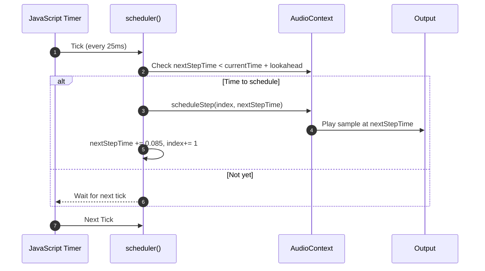

# Javascript fait du bruit
(mais en rythme)

## MixIt 2026 : Aliens

**Baptiste Lyet**

<!--
Aujourd'hui on va parler de javascript et de rythme
-->

---

# Merci aux sponsors !

<div style="display:flex;flex-wrap:wrap;gap:8px;">
  <span style="padding:2px 10px;border-radius:999px;background:#222;color:white;font-size:12px;">Esker</span>
  <span style="padding:2px 10px;border-radius:999px;background:#222;color:white;font-size:12px;">Siemens</span>
  <span style="padding:2px 10px;border-radius:999px;background:#222;color:white;font-size:12px;">Métropole de Lyon</span>
  <span style="padding:2px 10px;border-radius:999px;background:#222;color:white;font-size:12px;">CBTW</span>
  <span style="padding:2px 10px;border-radius:999px;background:#222;color:white;font-size:12px;">Ville de Lyon</span>
  <span style="padding:2px 10px;border-radius:999px;background:#222;color:white;font-size:12px;">Worldline</span>
  <span style="padding:2px 10px;border-radius:999px;background:#222;color:white;font-size:12px;">Energy Pool</span>
  <span style="padding:2px 10px;border-radius:999px;background:#222;color:white;font-size:12px;">Clever Cloud</span>
  <span style="padding:2px 10px;border-radius:999px;background:#222;color:white;font-size:12px;">Exotec</span>
  <span style="padding:2px 10px;border-radius:999px;background:#222;color:white;font-size:12px;">G2S</span>
  <span style="padding:2px 10px;border-radius:999px;background:#222;color:white;font-size:12px;">HIIT Consulting</span>
  <span style="padding:2px 10px;border-radius:999px;background:#222;color:white;font-size:12px;">Hack Your Job</span>
  <span style="padding:2px 10px;border-radius:999px;background:#222;color:white;font-size:12px;">Filigran</span>
  <span style="padding:2px 10px;border-radius:999px;background:#222;color:white;font-size:12px;">ADULLACT</span>
</div>

---

# Plan

- Présentation de DrumBeatRepo
- Définitions
- Construction d'une boîte à rythme
  - Naïve
  - Synchronisée


---

# Présentation de DrumBeatRepo

  https://www.drumbeatrepo.com

<!--
C'est beau ça marche mais il y a eu des problèmes.

Je vais vous présenter un des écueils et comment je suis passé dessus
-->
---

# Définitions
Musique et rythme

### Qu'est ce que la musique ?

Caractéristiques :

<v-click>

- Hauteur

</v-click>

<v-click>

- Nuance

</v-click>

<v-click>

- Timbre

</v-click>

<v-click>

- **Rythme**

</v-click>


<!--
Définitions de wikipedia

Combiner sons et silences au cours du temps
-->
---

# Définitions
Musique et rythme

### Qu'est ce que le rythme ?

<v-click>

<div class="flex flex-col items-center">
  <div class="flex justify-center gap-12">
    
    
  </div>
  <p class="mt-4 text-gray-500 text-sm">Comment lire une partition de batterie</p>
</div>

</v-click>

<!--
Définitions de wikipedia

Organisation dans le temps des évènements musicaux
-->

---

# Définitions
Séquenceurs et boîte à rythme

### Roland 808


💡 Il y a aussi des séquenceurs dans les logiciels de vidéos et les jeux vidéos
<!--
Machine ou logiciel qui génère des boucles de batterie/percussions répétitives et utilise en interne un **séquenceur**

- Musique assistée par ordinateur
- Jeux vidéos

Il y en a des analogiques, des numériques et aussi des versions logicielles. Ensemble on va voir comment en coder une en JS
-->
---

# Construction d'une boîte à rythme
Problématique

### Schéma rythmique
```json
"charleston"   : [" ", "", "", "", " ", "", "", "", " ", "", "", "", " ", "", "", ""],
"caisseClaire" : [" ", "", "", "", " ", "", "", "", " ", "", "", "", " ", "", "", ""],
"grosseCaisse" : ["X", "", "", "", "X", "", "", "", "X", "", "", "", "X", "", "", ""]
```


---

# Construction d'une boîte à rythme
Problématique

### Vitesse de lecture
- [Beats-per-minute calculator: 176bpm](https://toolstud.io/music/bpm.php?bpm=176&bpm_unit=4%2F4&base=16)
- 85 ms pour passer d'une case à l'autre avec un tempo de 176


<!--
85 ms
-->

---

# Construction d'une boîte à rythme naïve
## SetTimeout()
- Déclenche une fonction après un certain temps

```typescript  {monaco-run} {autorun:false}
function scheduler(){
    console.log("Case suivante");
}

console.log("Début");
setTimeout(scheduler, 85);
console.log("Fin");
```

---

# Construction d'une boîte à rythme naïve
## SetTimeout() récursif
- Déclenche une fonction à intervalles de temps réguliers

```typescript  {monaco-run} {autorun:false}
function scheduler(){
    console.log("Case suivante");
    setTimeout(scheduler, 85);
}

scheduler()
```
<!--
De toute façon le récursif ça ne me fait pas peur je fonce
-->

---

# Construction d'une boîte à rythme naïve

<div style="max-height: 400px; overflow:auto;">

```ts {monaco-run} {autorun:false}
const pattern = ["X","","","","X","","","","X","","","","X","","",""];
const audioSample = new Audio('sounds/kick.wav');

let index = 0;

function scheduler(): void {
    if (pattern[index] === "X") {
        audioSample.currentTime = 0;
        audioSample.play();
        console.log(index);
    }

    index = (index + 1) // % pattern.length;
    setTimeout(scheduler, 85); //85 ms
}

scheduler();
```

</div>

---

# Construction d'une boîte à rythme naïve

<div class="w-full max-w-3xl mx-auto">
  <SlidevVideo controls class="w-[90%] mx-auto rounded-xl">
    <source src="/videos/lag.mov" type="video/mp4" />
  </SlidevVideo>
</div>

---

# Construction d'une boîte à rythme naïve


## Inconvénients
- Précision à la milliseconde
- Interférences avec thread JavaScript principal
- Dérive d’horloge

---

<!--
Ne pas confondre avec un jitter ou avec une latence

Dérive d’horloge → décalage progressif dans le temps (long terme).
Jitter → fluctuations aléatoires d’un tick à l’autre (court terme).
-->

# Construction d'une boîte à rythme synchronisée

💡 Au lieu de déclencher les sons au dernier moment, on planifie les événements à l’avance.


## Synchronisation JS & WebAudioAPI

```ts {monaco-run} {autorun:false}
var audioContext = new AudioContext();
console.log(audioContext.currentTime);

setTimeout(() => console.log(audioContext.currentTime), 500);

```

---

# Construction d'une boîte à rythme synchronisée


---

# Construction : boîte à rythme synchronisée


---

# Construction d'une boîte à rythme synchronisée

<div style="max-height: 400px; overflow:auto;">

```ts {monaco-run} {autorun:false}
const pattern = ["X","","","","X","","","","X","","","","X","","",""];
const lookahead = 0.100; // 100ms

var audioContext = new AudioContext();
let kickBuffer: AudioBuffer;
let nextStepTime = audioContext.currentTime;
let index = 0;

fetch("/sounds/kick.wav")
        .then(r => r.arrayBuffer())
        .then(buf => audioContext.decodeAudioData(buf))
        .then(buffer => {
          kickBuffer = buffer;
          scheduler();
        });

function scheduler() {
    while (nextStepTime < audioContext.currentTime + lookahead) {
        scheduleStep(index, nextStepTime);
        setNextStep();
    }
    setTimeout(scheduler, 25); // 25ms
}

function scheduleStep(index: number, time: number) {
  if (pattern[index] === "X") {
    const source = audioContext.createBufferSource();
    source.buffer = kickBuffer;
    source.connect(audioContext.destination);
    source.start(time);
  }
}

function setNextStep() {
  nextStepTime += 0.085; //85 ms
  index = (index + 1);// % pattern.length;
}
```

</div>


<!--
**fetch()
Web Audio API (decodeAudioData)
Using it in a <canvas>
Reading metadata**

Avec ce second exemple j'ai besoin de décoder du coup j'ai eu un problème de CORS

J'ai utilisé CorsProxy pour pouvoir fetch le .wav et contourner les restrictions de mon navigateur web

J'utilise la fonction audio buffer qui me permet de stocker en mémoire le sample, échantillon
-->
---

# Construction d'une boîte à rythme synchronisée

<div class="w-full max-w-3xl mx-auto">
  <SlidevVideo controls class="w-[90%] mx-auto rounded-xl">
    <source src="/videos/good.mov" type="video/mp4" />
  </SlidevVideo>
</div>

---

# Conclusion

### Notions
- Minuteur / timer
- Horloge / clock

<v-click>

### Solution
- Synchronisation d'horloge JavaScript avec horloge tierce (WebAudioAPI)

</v-click>

<v-click>

### Aller plus loin
- UI - **requestAnimationFrame()**
- Changement de tempo et **TimeStretch**
- Synchroniser plusieurs séquenceurs ?

</v-click>

<!--
On pourrait penser aux effets de changements de tempo et de timestrech
Note : c'est dur à faire à la fois pour les musiciens et musiciennes et pour les machines
-->

---

# Merci !

--> **Baptiste Lyet** - Développeur .NET/Angular 6/7 ans d'XP

</> DrumBeatRepo : https://www.github.com/Babali42/drumbeatrepo


Source : A tales of two clocks - Chris Wilson - 2013

